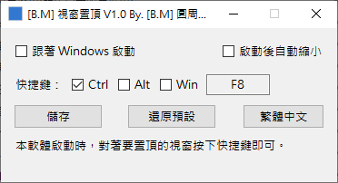

# [B.M] 視窗置頂

[](#系統需求)
[](https://www.python.org/)
[](https://pyinstaller.org/)
[](https://github.com/BoringMan314/bm-windows-on-top)
[](LICENSE)

Windows 前景視窗一鍵切換「最上層顯示」，支援自訂全域快捷鍵、開機啟動、啟動後自動縮小、系統匣與多語系介面。

*Windows 前台窗口一键切换「置顶」，支持自定义全局快捷键、开机启动、启动后自动最小化到托盘与多语言界面。*  

*Windows の前面ウィンドウをワンキーで「常に手前」表示に切替。グローバルホットキー、スタートアップ、起動後トレイ格納、トレイ操作、多言語 UI に対応。*  

*A Windows utility to toggle always-on-top for the foreground window via a global hotkey, with autostart, optional launch-to-tray, tray controls, and multilingual UI.*

> **聲明**：本專案為第三方輔助工具，請遵守各平台與軟體使用規範。部分高權限或 UWP／殼層視窗可能無法被強制改變 Z 序，屬作業系統限制。

---



---

## 目錄

- [功能](#功能)
- [系統需求](#系統需求)
- [安裝與打包](#安裝與打包)
- [檢查流程（建議）](#檢查流程建議)
- [本機開發與測試](#本機開發與測試)
- [技術概要](#技術概要)
- [專案結構](#專案結構)
- [設定檔與多語系](#設定檔與多語系)
- [隱私說明](#隱私說明)
- [授權](#授權)
- [問題與建議](#問題與建議)

---

## 功能

- 對目前前景視窗切換 **最上層**／取消最上層（以 `SetWindowPos` 為主）。
- 快捷鍵可設 **Ctrl／Win／Alt** 組合，按鍵限 **F1–F12** 或單一英數字元（預設 **Ctrl+F8**）；可儲存與還原預設並寫入 JSON。
- 選項：**跟著 Windows 啟動**（寫入目前使用者 Run 機碼）、**啟動後自動縮小**（進系統匣）。
- 內建語言：繁體中文、簡體中文、日本語、English；**可**在設定檔根層 `languages` **新增**其他語系代碼（例如 `ko_KR`）。**每一**語系物件的**鍵集合**須與程式內建參考（`zh_TW`）**完全一致**，缺一即驗證失敗，程式會刪除壞檔並寫入內建預設。
- 系統匣（pystray）：
  - 左鍵預設動作可還原主視窗至第一螢幕 `100,100` 並置前
  - 右鍵選單：關於我、離開（文字隨語系更新；鍵名為 `about`、`exit`）
- 防多開：後開透過 Mutex + Named Pipe 通知前開靜默退出（含 EXE 改名／複製情境）。
- 切換置頂成功時播放 `wav/switch.wav`（Windows 使用 `winsound`）。

---

## 系統需求

- **Windows 10+**（一般使用專案根目錄的 `bm-windows-on-top.exe`）。
- **Windows 7** 請使用專案根目錄的 **`bm-windows-on-top_win7.exe`**（以 Python 3.8.x 建置）；執行前請完成下方〈Win7 執行前必要環境〉（細節與疑難排解見 `README-WIN7.txt`）。
- 開發／打包：**Win10 鏈**需本機 **Python 3.10+**；**Win7 鏈**需本機 **Python 3.8.x**（僅 3.8）。

### Win7 執行前必要環境

- Windows 7 SP1。
- 安裝系統更新：`KB2533623`、`KB2999226`（Universal CRT）。
- 安裝 **Microsoft Visual C++ Redistributable 2015–2022**（x86／x64 依系統選擇）。
- 若啟動仍出現缺少 `api-ms-win-core-*.dll`，請依 `README-WIN7.txt` 核對更新與執行檔版本後再試。

---

## 安裝與打包

### 安裝（使用 Releases）

1. 下載 [Releases](https://github.com/BoringMan314/bm-windows-on-top/releases) 的 `bm-windows-on-top.exe`（或於 Win7 使用 `bm-windows-on-top_win7.exe`）。
2. 放到任意資料夾後直接執行。
3. 首次執行會在同目錄建立 `bm-windows-on-top.json`（**Win10／Win7 兩種 exe 共用**同一份設定檔）。

### Windows 7

```bat
build_win7.bat
```

輸出（專案**根目錄**）：

- `bm-windows-on-top_win7.exe`

### Windows 10/11

```bat
build_win10.bat
```

輸出（專案**根目錄**）：

- `bm-windows-on-top.exe`

### Windows（雙版本：依序呼叫兩支 bat）

```bat
build_win10+win7.bat
```

輸出（專案**根目錄**）：

- `bm-windows-on-top.exe`（Win10/11 鏈，Python 3.10+）
- `bm-windows-on-top_win7.exe`（Win7 鏈，**僅** Python 3.8.x）

說明：

- `build.py` 內之流程：先執行 `gen_icons.py`，再檢查 `icons\icon.ico` 與 `wav\switch.wav`；以 PyInstaller 建置（`--specpath` 設於 `build`）、將 exe 搬回專案根目錄，最後清空 `build`／`dist`。
- `build_win10.bat`／`build_win7.bat` 負責選用正確的 Python 與 `pip install -r requirements-*.txt`，然後呼叫 `build.py win10` 或 `win7`。
- 在 Win7 上請執行 `bm-windows-on-top_win7.exe`，不要執行 `bm-windows-on-top.exe`。
- 若缺少 `icons` 或 `wav`，可先手動執行 `gen_icons.py`、`gen_switch_wav.py` 備好素材再打包。

---

## 檢查流程（建議）

1. 啟動後主視窗是否出現於第一螢幕約 `100,100`。
2. 對一般傳統 Win32 視窗按快捷鍵，能否切換最上層／還原。
3. 快捷鍵在視窗縮到系統匣後是否仍可用。
4. 語言按鈕循環、`bm-windows-on-top.json` 讀寫是否正常（**每個**語系區塊鍵集須與內建 `zh_TW` 一致，否則會覆寫為預設）。
5. 系統匣左鍵預設動作能否還原視窗；右鍵「關於我」「離開」是否正常。
6. 連續啟動兩次是否僅保留最後一個實例。
7. 勾選／取消「跟著 Windows 啟動」後，登錄檔 Run 值是否相符。

---

## 本機開發與測試

```bash
python -m pip install -r requirements-win10.txt
python main.py
```

（僅維護 Win7 鏈時，請改用 Python 3.8 虛擬環境並安裝 `requirements-win7.txt`。）

---

## 技術概要

- GUI：`tkinter`
- 置頂：Win32 `SetWindowPos`（ctypes）
- 系統匣：`pystray` + `Pillow`
- 熱鍵：`keyboard` 套件（全域熱鍵）
- 防多開：`CreateMutexW`（`Global\bm-windows-on-top`）+ Named Pipe IPC
- 打包：`pyinstaller`（onefile、無主控台，由 `build.py` 帶入 `--windowed` 等同效果）
- 設定檔：EXE 同層 `bm-windows-on-top.json`（Win10／Win7 exe 共用）

---

## 專案結構


| 路徑                            | 說明                                      |
| ----------------------------- | --------------------------------------- |
| `main.py`                      | 主程式（UI、熱鍵、置頂、系統匣、防多開、設定）            |
| `build.py`                      | Windows 單檔建置邏輯（`gen_icons`、PyInstaller）                    |
| `build_win7.bat`               | Win7 單檔打包（最終 exe 於專案根目錄）               |
| `build_win10.bat`              | Win10 單檔打包（最終 exe 於專案根目錄）              |
| `build_win10+win7.bat`         | 依序呼叫上兩者                                |
| `version_info.txt`             | Windows 檔案版本資源                         |
| `requirements-win10.txt`       | Win10/11 打包用 Python 相依套件               |
| `requirements-win7.txt`        | Win7 打包用 Python 相依套件                 |
| `README-WIN7.txt`              | Win7 執行環境（KB／VC++）說明                |
| `gen_icons.py`                 | 產生／檢查 `icons` 圖示                     |
| `gen_switch_wav.py`            | 產生 `wav/switch.wav`（若專案內需重建）        |
| `icons/`                       | 圖示資源（`icon.ico`、`icon.png`）           |
| `wav/`                         | 音效資源（`switch.wav`）                    |
| `screenshot/`                  | README 展示截圖（選用）                       |


---

## 設定檔與多語系

- 設定檔：`bm-windows-on-top.json`（與 exe 同層）。
- `settings` 主要欄位：`languages`（目前 UI 語系代碼，且須為根層 `languages` 內**已存在**之鍵）、`auto_start`、`auto_minimize`、`hotkey`（`ctrl`／`win`／`alt`／`key`）。
- **內層嚴格**：根層 `languages` 底下**每一個**語系物件的**鍵集合**須與程式內建 `zh_TW` 區塊**完全相同**（鍵名與 `main.py` 之 `_default_config_dict()` 一致）。**不可**只填部分鍵指望程式補齊；驗證失敗時會刪除壞檔並寫入內建預設。
- **外層可擴**：語系代碼數量**不**限於四個；語言循環順序為內建 `zh_TW`→`zh_CN`→`ja_JP`→`en_US`（僅含檔內實際存在之鍵），其餘自訂代碼接在後方，依 JSON 內出現序。

在既有設定檔的 `languages` 中**新增**一個語系時，請貼上**完整**區塊。以下為**可直接使用**的韓文範例（鍵順序與內建 `zh_TW` 對齊）：

```json
"ko_KR": {
  "language_name": "한국어",
  "settings": "설정",
  "project_name": "항상 위에",
  "hotkey_label": "단축키:",
  "autostart_checkbox": "Windows 시작 시 실행",
  "auto_minimize_checkbox": "시작 후 트레이로 최소화",
  "btn_hotkey_save": "저장",
  "btn_hotkey_restore": "기본값으로 복원",
  "about": "정보",
  "exit": "종료",
  "help_text": "실행한 뒤 맨 앞에 둘 창을 선택하고 단축키를 누르면 항상 위에 표시를 켜거나 끕니다."
}
```

並將 `settings.languages` 設為 `ko_KR`（若要以韓文啟動）。併入後請確認 JSON 仍符合上述**鍵集全等**規則。

---

## 隱私說明

本工具為本機端執行程式，預設僅在本機讀寫同目錄設定檔（`*.json`）及可選之登錄檔「跟著 Windows 啟動」項目，**不蒐集、不上傳**個人資料或使用行為資料。

目前程式僅有以下外部互動：

- 使用者在系統匣選單點擊「關於我」時，會開啟 `http://exnormal.com:81/`。
- 使用者自行透過 GitHub 下載、更新或回報 Issue 時，會依 GitHub 平台規則產生對應網路請求。

---

## 授權

本專案以 [MIT License](LICENSE) 授權。

---

## 問題與建議

歡迎使用 [GitHub Issues](https://github.com/BoringMan314/bm-windows-on-top/issues) 回報錯誤或提出建議（請附上系統版本、重現步驟、錯誤訊息）。
